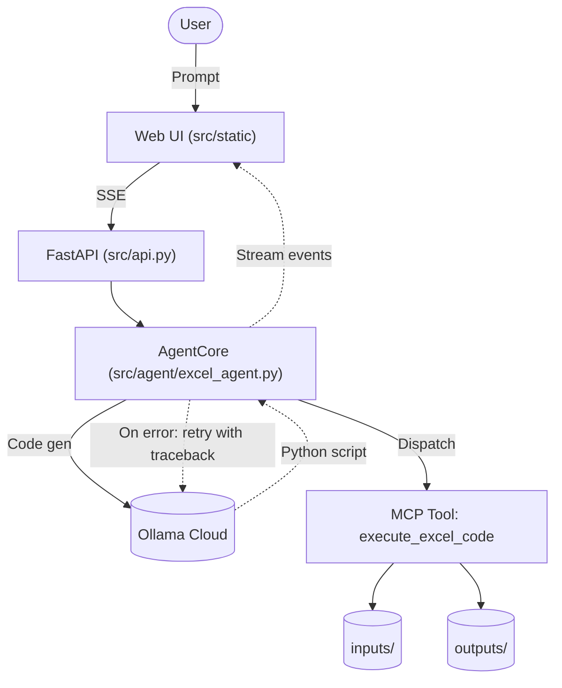

<p align="center">
  <h1 align="center">SheetPT</h1>
  <p align="center"><strong>Spreadsheet Intelligence Agent</strong> — natural language to Excel analysis, executed through an MCP tool server.</p>
</p>

<p align="center">
  
  
  
  
</p>

---

## Overview

SheetPT takes natural-language data tasks, generates Python (pandas / openpyxl / matplotlib) with an LLM via Ollama Cloud, and executes it through an isolated MCP tool server. If execution fails, the error log is fed back to the agent, which patches its own code — including dynamically installing missing libraries.

## Features

- Agentic retry loop with self-healing code execution
- Live, streaming UI (Server-Sent Events) for every attempt / code / error / result
- HTML/CSS/JS frontend with a dark agent-chat interface
- Streamlit UI and CLI agent retained as alternates
- MCP server exposing a single `execute_excel_code` tool
- File upload, inputs/outputs workspace directories

## Quick Start

```bash
python3 -m venv venv
source venv/bin/activate
pip install -r requirements.txt
```

Create `.env`:

```env
OLLAMA_API_KEY=your_key_here
OLLAMA_BASE_URL=https://ollama.com/v1
OLLAMA_MODEL=gpt-oss:120b
MAX_RETRIES=3
```

Run the web app:

```bash
uvicorn src.api:app --host 0.0.0.0 --port 8000
```

Then open http://localhost:8000.

Alternative entry points:

```bash
python -m streamlit run src/app.py                      # Streamlit UI
python src/cli_agent.py --prompt "Summarize missing values in inputs/train_data.csv"
```

## Configuration

| Variable | Default | Description |
|---|---|---|
| `OLLAMA_API_KEY` | `dummy` | Ollama Cloud API key |
| `OLLAMA_BASE_URL` | `https://ollama.com/v1` | API base URL |
| `OLLAMA_MODEL` | `gpt-oss:120b` | Model name |
| `MAX_RETRIES` | `3` | Self-healing retry attempts |

## Project Structure

```
.
├── Docs/                     # Technical docs
│   ├── ARCHITECTURE.md
│   └── USER_GUIDE.md
├── inputs/                   # Uploaded datasets
├── outputs/                  # Generated reports / plots
├── src/
│   ├── api.py                # FastAPI entry point (web UI + SSE API)
│   ├── config.py             # Pydantic settings
│   ├── cli_agent.py          # CLI runner
│   ├── agent/
│   │   └── excel_agent.py    # ExcelAgent — retry/self-healing loop
│   ├── frontend/
│   │   └── app.py            # Streamlit UI (fallback)
│   ├── mcp_server/
│   │   └── server.py         # MCP server + execute_excel_code tool
│   └── static/               # HTML/CSS/JS frontend
│       ├── index.html
│       ├── styles.css
│       └── app.js
├── .env
├── requirements.txt
└── README.md
```

## System Architecture



## API Endpoints

| Method | Path | Purpose |
|---|---|---|
| `GET` | `/` | Serves the web UI |
| `GET` | `/api/files` | List inputs/outputs |
| `GET` | `/api/models` | Available models |
| `POST` | `/api/upload` | Save a dataset to `inputs/` |
| `POST` | `/api/run` | Run a task, streams events via SSE |

## Docker

```bash
docker compose up --build
```

Then open http://localhost:8000. Requires a `.env` with a valid `OLLAMA_API_KEY`.

## Safety Note

`execute_excel_code` executes arbitrary Python in the server process. Do not expose the service publicly without authentication; container isolation is recommended for untrusted prompts.
