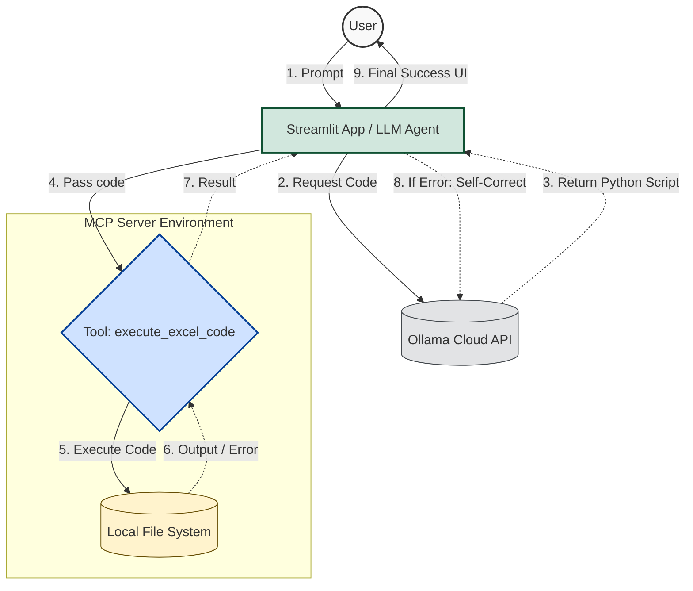

# Excel Analyst Agent (MCP Server & Streamlit UI)

## Overview
This project is an **Agentic Excel Analyst** that takes natural language requests from users, dynamically generates Python code to fulfill those requests (using pandas, openpyxl, matplotlib, etc.), and securely executes the code locally using an MCP (Model Context Protocol) Server architecture. 

It features a **Streamlit Web UI** for a clean user experience and an **Agentic Retry Loop** that allows the agent to self-correct and install missing libraries automatically if an execution error occurs.

## Key Features
- 🗣 **Natural Language to Excel**: Simply ask to create sheets, modify data, or plot charts.
- 🔄 **Agentic Self-Correction**: If the generated code fails (e.g., a `ModuleNotFoundError` or syntax error), the system feeds the error back to the LLM, which debugs its own code and retries up to 3 times.
- ⚙️ **MCP Server Execution**: Code execution is decoupled into an MCP tool (`execute_excel_code`), maintaining a strict boundary between the intelligence (LLM) and the execution environment.
- 🌐 **Streamlit UI**: A clean, interactive frontend to watch the agent "think", see the generated code, and view the final output.

---

## Project Structure

| File | Description |
|------|-------------|
| `app.py` | The main **Streamlit application**. It acts as the LLM Agent, holding the conversation context, interacting with the Ollama API, rendering the UI, and managing the Agentic Retry Loop. |
| `server.py` | The **MCP Server**. Exposes a single tool (`execute_excel_code`) that takes the raw Python string generated by the agent and safely executes it via `exec()`, capturing outputs and errors. |
| `demo_agent.py` | A simple console-based version of the agent (used for initial testing before the UI was built). |
| `.env` | Configuration file holding the API keys, Model name, and Base URL for the Ollama Cloud instance. |
| `requirements.txt` | Python dependencies required to run the project. |

---

## System Architecture



---

## Prerequisites & Installation

1. **Python 3.10+** installed.
2. Clone this repository or open the project folder.
3. Create a virtual environment and activate it:
   ```powershell
   python -m venv venv
   .\venv\Scripts\Activate.ps1
   ```
4. Install the dependencies:
   ```powershell
   pip install -r requirements.txt
   ```
5. Ensure your `.env` file is properly configured. Example:
   ```env
   OLLAMA_MODEL=llama3.1
   OLLAMA_API_KEY=your_api_key_here
   OLLAMA_BASE_URL=https://ollama.com/v1
   ```

---

## How to Run the App

Ensure your virtual environment is active, then run the Streamlit application:

```powershell
python -m streamlit run app.py
```

- The terminal will provide a `Local URL` (typically `http://localhost:8501`).
- Open this URL in your web browser.
- Enter a prompt like: *"Create an excel file with 5 random tech products and their prices, then plot a bar chart of the prices using matplotlib and save it as an image."*
- Watch the agent generate the code, install `matplotlib` if necessary, execute it, and return your results!
