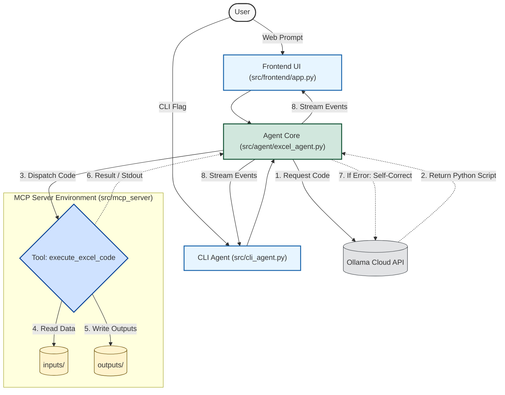

# Excel Analyst Agent (MCP Server & Streamlit UI)

## Overview
This project is an **Agentic Excel Analyst** that takes natural language requests from users, dynamically generates Python code to fulfill those requests (using pandas, openpyxl, matplotlib, etc.), and securely executes the code locally using an MCP (Model Context Protocol) Server architecture. 

It features a modular **Streamlit Web UI**, an isolated **Agent Core**, and an **Agentic Retry Loop** that allows the agent to self-correct and install missing libraries automatically if an execution error occurs.

---

## Project Structure

```
.
├── Docs/                     # Documentation & technical guides
│   ├── ARCHITECTURE.md
│   └── USER_GUIDE.md
├── inputs/                   # Input datasets (CSV, Excel)
│   ├── dummy_sales_data.xlsx
│   ├── test_data.csv
│   ├── train_data.csv
│   └── train_data_cleaned.csv
├── outputs/                  # Generated files and analysis plots
│   ├── boda.xlsx
│   ├── cloud_demo.xlsx
│   ├── titanic_eda_report.xlsx
│   └── eda_plots/
│       ├── age_distribution.png
│       ├── correlation_heatmap.png
│       ├── survival_by_sex.png
│       └── survival_count.png
├── src/                      # Source code root
│   ├── __init__.py
│   ├── config.py             # Pydantic Settings & schema configuration
│   ├── app.py                # Main web application entry point
│   ├── cli_agent.py          # Structured CLI Agent runner
│   ├── agent/                # Agent Core package (LLM & retry logic)
│   │   ├── __init__.py
│   │   └── excel_agent.py    # ExcelAgent class & self-healing generator
│   ├── frontend/             # Dedicated UI module
│   │   ├── __init__.py
│   │   └── app.py            # Streamlit dashboard
│   └── mcp_server/           # MCP Server package
│       ├── __init__.py
│       └── server.py         # MCP execution server & tools
├── .env                      # Environment variables
├── .gitignore
├── README.md
└── requirements.txt
```

---

## System Architecture



---

## How to Run

### 1. Launch the Frontend Web UI:
```powershell
python -m streamlit run src/frontend/app.py
```
*(Or `python -m streamlit run src/app.py`)*

### 2. Launch the CLI Agent:
```powershell
python src/cli_agent.py --prompt "Read inputs/train_data.csv and summarize missing values"
```
